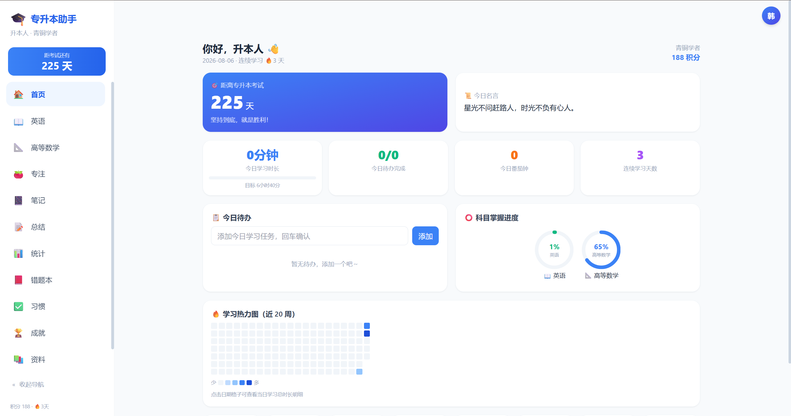
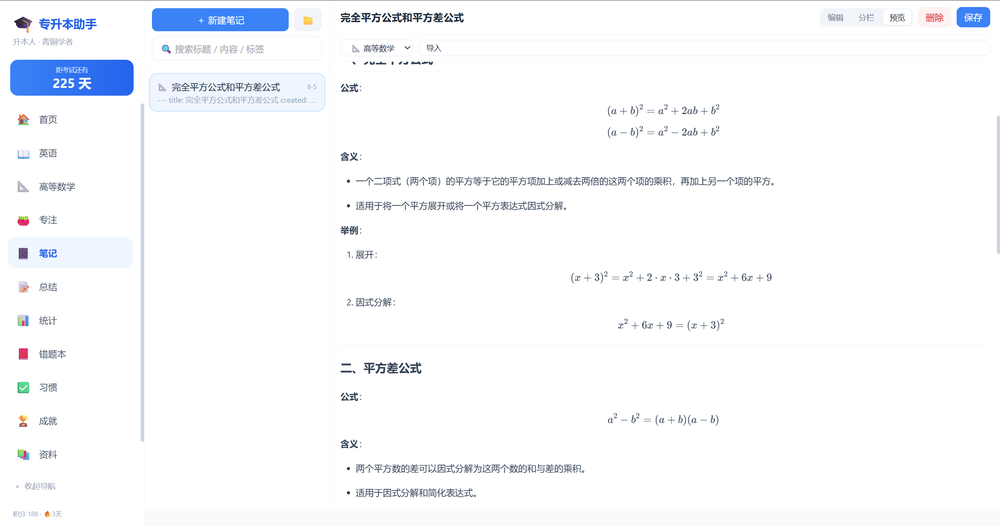
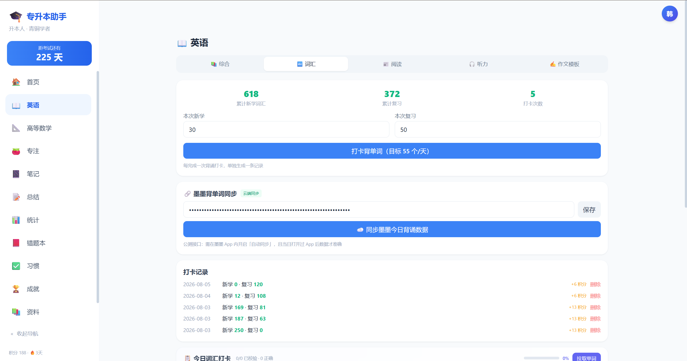
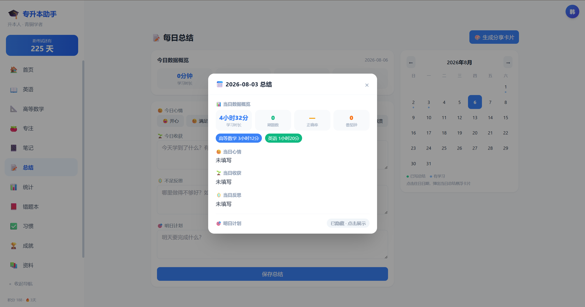
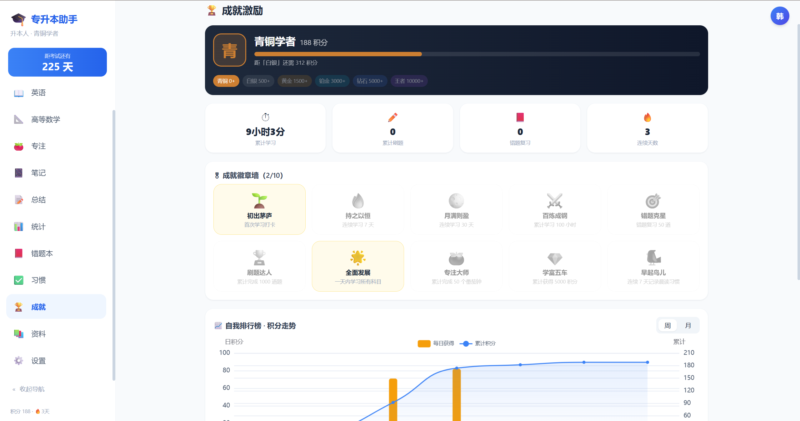

<div align="center" style="background-color:#0d1117;border:1px solid #21262d;border-radius:12px;padding:40px 20px 24px 20px;margin:16px 0;">


# [专升本学习助手](https://zsb-study-tracker.sryze.cc/)

**zsb-study-tracker** · 专升本备考打卡管理助手（Web + 桌面端）

<span style="color:#8b949e;">学习记录 · 番茄钟 · 游戏化激励 · 数据可视化 · 多账号本地存储</span>

<br/>

[](https://vuejs.org/)
[](https://www.typescriptlang.org/)
[](https://vitejs.dev/)
[](https://tailwindcss.com/)
[](https://www.electronjs.org/)
[](https://pinia.vuejs.org/)
[](https://echarts.apache.org/)
[](https://katex.org/)

<br/>

[](https://github.com/Han050912/zsb-study-tracker/actions/workflows/deploy-pages.yml)
[](https://github.com/Han050912/zsb-study-tracker/actions/workflows/deploy-worker.yml)

<br/>

> [:arrow_right: English version](./README_EN.md)

</div>

---

## 📑 目录

<div style="background-color:#0d1117;border:1px solid #21262d;border-radius:8px;padding:20px 24px;margin:16px 0;">

<table align="center">
  <tr>
    <td align="center" width="33%" style="padding:6px 12px;"><a href="#-项目简介" style="text-decoration:none;color:#58a6ff;">✨ 项目简介</a></td>
    <td align="center" width="33%" style="padding:6px 12px;"><a href="#-效果图" style="text-decoration:none;color:#58a6ff;">📸 效果图</a></td>
    <td align="center" width="33%" style="padding:6px 12px;"><a href="#-快速上手" style="text-decoration:none;color:#58a6ff;">🚀 快速上手</a></td>
  </tr>
  <tr>
    <td align="center" style="padding:6px 12px;"><a href="#-参与贡献指南" style="text-decoration:none;color:#58a6ff;">🤝 贡献指南</a></td>
    <td align="center" style="padding:6px 12px;"><a href="#-许可证-license" style="text-decoration:none;color:#58a6ff;">📜 许可证</a></td>
    <td align="center" style="padding:6px 12px;"><a href="#-about-me" style="text-decoration:none;color:#58a6ff;">👤 About Me</a></td>
  </tr>
  <tr>
    <td align="center" colspan="3" style="padding:6px 12px;"><a href="#-请我喝咖啡" style="text-decoration:none;color:#58a6ff;">☕ 请我喝咖啡</a></td>
  </tr>
</table>

</div>

---

## ✨ 项目简介

<div style="background-color:#0d1117;border:1px solid #21262d;border-left:4px solid #f78166;border-radius:4px;padding:20px 24px;margin:16px 0;">

「专升本学习助手」是一款面向专升本考生的**备考打卡管理应用**，提供 **Web 版** 与 **Windows / macOS 桌面版**。所有数据均在本地保存，无需后端服务器，开箱即用、隐私可控。

</div>

<div style="background-color:#0d1117;border:1px solid #21262d;border-left:4px solid #58a6ff;border-radius:4px;padding:16px 24px;margin:16px 0;">

> **核心定位**：把「记录 → 专注 → 激励 → 复盘」串成一条完整的学习闭环。

</div>

### 为什么选择这个项目

<table align="center">
  <tr>
    <td width="50%" valign="top" style="background-color:#0d1117;border:1px solid #21262d;border-radius:8px;padding:16px;">
      <strong style="color:#f78166;">🔗 一条龙学习闭环</strong><br/>
      <span style="color:#8b949e;">每日打卡、番茄钟专注、错题整理、晚间总结反思，备考全流程在一个工具里搞定，不用在多个 App 间来回切换</span>
    </td>
    <td width="50%" valign="top" style="background-color:#0d1117;border:1px solid #21262d;border-radius:8px;padding:16px;">
      <strong style="color:#f78166;">🔒 数据完全归你</strong><br/>
      <span style="color:#8b949e;">所有学习记录、账号数据都只存在你电脑里，不上传任何服务器，断网也能正常使用</span>
    </td>
  </tr>
  <tr>
    <td width="50%" valign="top" style="background-color:#0d1117;border:1px solid #21262d;border-radius:8px;padding:16px;">
      <strong style="color:#f78166;">🎮 游戏化让你坚持</strong><br/>
      <span style="color:#8b949e;">青铜到王者的段位爬升、成就徽章墙、连胜记录，把枯燥的长期备考变成闯关体验</span>
    </td>
    <td width="50%" valign="top" style="background-color:#0d1117;border:1px solid #21262d;border-radius:8px;padding:16px;">
      <strong style="color:#f78166;">📐 高数与英语专项强化</strong><br/>
      <span style="color:#8b949e;">考纲章节树、Markdown + LaTeX 公式笔记、搭配「墨墨背单词」App 逐条打卡、完形 / 阅读 / 听力 / 作文模板多维记录</span>
    </td>
  </tr>
  <tr>
    <td width="50%" valign="top" style="background-color:#0d1117;border:1px solid #21262d;border-radius:8px;padding:16px;">
      <strong style="color:#f78166;">⚙️ 科目随你定</strong><br/>
      <span style="color:#8b949e;">高数和英语是默认科目（权重各 50%），你可以随时调整权重，也能新增或删除任何科目</span>
    </td>
    <td width="50%" valign="top" style="background-color:#0d1117;border:1px solid #21262d;border-radius:8px;padding:16px;">
      <strong style="color:#f78166;">📊 图表一目了然</strong><br/>
      <span style="color:#8b949e;">学习热力图、掌握度雷达图、正确率趋势、专注时长分布，学习效果全可视化</span>
    </td>
  </tr>
  <tr>
    <td width="50%" valign="top" style="background-color:#0d1117;border:1px solid #21262d;border-radius:8px;padding:16px;">
      <strong style="color:#f78166;">🖥️ 桌面端免费可用</strong><br/>
      <span style="color:#8b949e;">Windows / macOS 原生客户端，常驻系统托盘、定时提醒、自动更新</span>
    </td>
    <td width="50%" valign="top" style="background-color:#0d1117;border:1px solid #21262d;border-radius:8px;padding:16px;">
      <strong style="color:#f78166;">🛡️ 隐私安全零顾虑</strong><br/>
      <span style="color:#8b949e;">不连后端、不接数据库，你的学习数据永远留在自己的设备上</span>
    </td>
  </tr>
</table>

---

## 📸 效果图

<div style="background-color:#0d1117;border:1px solid #21262d;border-radius:12px;padding:24px;margin:24px 0;">

### 📊 首页仪表盘

<span style="color:#8b949e;">今日概览、待办、学习热力图、科目掌握度与今日名言，一屏掌握当日学习节奏。</span>

<br/><br/>



</div>

<div style="background-color:#0d1117;border:1px solid #21262d;border-radius:12px;padding:24px;margin:24px 0;">

### 📝 笔记中心（Markdown + LaTeX）

<span style="color:#8b949e;">基于 KaTeX 的数学公式渲染，支持 Markdown 全量语法与笔记检索。</span>

<br/><br/>



</div>

<div style="background-color:#0d1117;border:1px solid #21262d;border-radius:12px;padding:24px;margin:24px 0;">

### 📖 英语打卡（搭配「墨墨背单词」App）

<span style="color:#8b949e;">与墨墨背单词 App 配合，自定义每日目标，完形、阅读、听力、作文模板多维记录，自动累计积分。</span>

<br/><br/>



</div>

<div style="background-color:#0d1117;border:1px solid #21262d;border-radius:12px;padding:24px;margin:24px 0;">

### 📅 每日总结

<span style="color:#8b949e;">自动聚合今日学习数据，支持情绪日志 + 三段式反思 + 明日计划，一键生成分享卡片。</span>

<br/><br/>



</div>

<div style="background-color:#0d1117;border:1px solid #21262d;border-radius:12px;padding:24px;margin:24px 0;">

### 🏆 成就激励

<span style="color:#8b949e;">青铜 → 王者段位体系、徽章墙、自我排行榜，让坚持有看得见的回报。</span>

<br/><br/>



</div>

---

## 🚀 快速上手

<div style="background-color:#0d1117;border:1px solid #21262d;border-radius:8px;padding:20px 24px;margin:16px 0;">

> 你电脑上需要先装好 **Node.js 18 或更高版本**（可以去 [nodejs.org](https://nodejs.org) 下载安装包，像装普通软件一样下一步就行）。

</div>

### 在浏览器里跑起来

打开终端（Windows 按 `Win+R` 输入 `cmd`，Mac 打开「终端」），依次敲下面几条命令：

```bash
# 把项目代码下载到本地
git clone https://github.com/Han050912/zsb-study-tracker.git
cd zsb-study-tracker

# 安装项目需要的依赖包（第一次会比较慢，后面就快了）
npm install

# 启动开发服务器，浏览器会自动打开页面
npm run dev
```

### 在桌面客户端里跑起来

```bash
# 浏览器和桌面端同时启动，改代码两边都会自动刷新
npm run electron:dev
```

### 打包成安装文件

想把应用打包成 `.exe` 或 `.dmg` 发给同学用？跑下面命令就行：

```bash
npm run dist:win    # 打包 Windows 安装包，输出在 release/ 文件夹
npm run dist:mac    # 打包 Mac 安装包（需要在 Mac 电脑上执行）
npm run dist        # 自动识别你当前的系统来打包
```

打包好的桌面端会自动检查新版本并提示更新，不需要手动下载覆盖。

---

## 🤝 参与贡献指南

<div style="background-color:#0d1117;border:1px solid #21262d;border-radius:8px;padding:20px 24px;margin:16px 0;">

欢迎任何形式的贡献！标准流程如下：

<br/>

<table align="center">
  <tr>
    <td align="center" width="25%" style="padding:12px;">
      <span style="display:inline-block;background-color:#1f6feb;color:#fff;border-radius:50%;width:28px;height:28px;line-height:28px;text-align:center;font-weight:700;font-size:14px;">1</span>
      <br/><strong>Fork</strong><br/>
      <span style="color:#8b949e;font-size:13px;">本仓库到你的账号</span>
    </td>
    <td align="center" width="25%" style="padding:12px;">
      <span style="display:inline-block;background-color:#1f6feb;color:#fff;border-radius:50%;width:28px;height:28px;line-height:28px;text-align:center;font-weight:700;font-size:14px;">2</span>
      <br/><strong>新建分支</strong><br/>
      <span style="color:#8b949e;font-size:13px;"><code>feat/xxx</code> 或 <code>fix/xxx</code></span>
    </td>
    <td align="center" width="25%" style="padding:12px;">
      <span style="display:inline-block;background-color:#1f6feb;color:#fff;border-radius:50%;width:28px;height:28px;line-height:28px;text-align:center;font-weight:700;font-size:14px;">3</span>
      <br/><strong>编码</strong><br/>
      <span style="color:#8b949e;font-size:13px;">本地验证通过</span>
    </td>
    <td align="center" width="25%" style="padding:12px;">
      <span style="display:inline-block;background-color:#1f6feb;color:#fff;border-radius:50%;width:28px;height:28px;line-height:28px;text-align:center;font-weight:700;font-size:14px;">4</span>
      <br/><strong>提交 PR</strong><br/>
      <span style="color:#8b949e;font-size:13px;">到 <code>development</code> 分支</span>
    </td>
  </tr>
</table>

</div>

### 代码规范

<div style="background-color:#0d1117;border:1px solid #21262d;border-radius:8px;padding:16px 24px;margin:16px 0;">

- 使用 **TypeScript**，遵循 Vue 3 `<script setup>` 风格
- 样式统一使用 **Tailwind CSS**，移动端优先响应式
- 保持现有目录结构与命名风格

</div>

### 提交规范

<div style="background-color:#0d1117;border:1px solid #21262d;border-radius:8px;padding:16px 24px;margin:16px 0;">

- 遵循 [Conventional Commits](https://www.conventionalcommits.org/zh-hans/)：`feat:` / `fix:` / `docs:` / `refactor:` 等
- 示例：`feat: 新增单词背诵统计图表`

</div>

### 反馈与建议

- **Bug 反馈**：[提交 Issue](https://github.com/Han050912/zsb-study-tracker/issues/new)
- **需求建议**：同样通过 Issue 提出，并打上 `enhancement` 标签

---

## 📜 许可证 License

<div style="background-color:#0d1117;border:1px solid #21262d;border-radius:8px;padding:16px 24px;margin:16px 0;text-align:center;">

本项目基于 <a href="./LICENSE"></a> 开源。

</div>

---

## 👤 About Me

<div style="background-color:#0d1117;border:1px solid #21262d;border-radius:12px;padding:24px;margin:16px 0;text-align:center;">

**Han050912** · 一名正在备考专升本、热爱折腾工具的开发者。

<br/>

<a href="https://blog.csdn.net/hajai?spm=1000.2115.3001.5343">
  
</a>
<a href="https://x.com/hanhaoyi888">
  
</a>
<a href="https://discord.gg/49C9ZGqX4">
  
</a>
<a href="https://t.me/hanhaoyi888">
  
</a>

</div>

---

## ☕ 请我喝咖啡

<div style="background-color:#0d1117;border:1px solid #21262d;border-radius:12px;padding:24px;margin:16px 0;text-align:center;">

如果这个项目对你有帮助，欢迎请我喝杯咖啡，让工具持续迭代下去 ☕

<br/>

| 微信支付 | 支付宝 |
| :---: | :---: |
|  |  |

</div>
